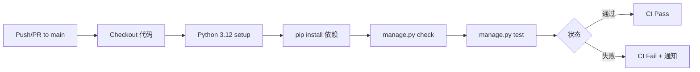
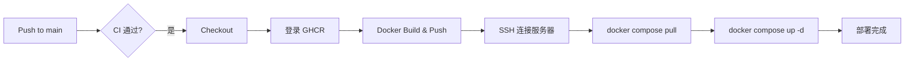

## 用户需求

为 Django 博客项目搭建完整的 **GitHub Actions CI/CD 自动化流水线**，按照用户桌面的 cicd 流程文档方案（GHCR 中转 + SSH 远程部署）。项目当前还不是 git 仓库，需要从零开始初始化并关联 GitHub。

## 核心功能

- **Git 初始化**：创建 `.gitignore`、`git init`、关联 GitHub 仓库
- **CI 持续集成**：push/PR 到 main 时自动跑 `manage.py check` + `manage.py test`
- **CD 持续部署**：push main 时自动构建 Docker 镜像 → 推送到 GHCR → SSH 连接服务器拉取并重启容器
- **安全修复**：将 `docker-compose.yml` 中明文硬编码的 `SECRET_KEY` 改为环境变量注入
- **环境变量文档化**：创建 `.env.example` 说明生产部署所需变量

## 不对交付物

- 服务器端 Docker/deploy 用户安装需用户手动完成（非代码部分）
- GitHub PAT + 4 Secrets 配置需用户在 GitHub 网页手动完成

## 技术栈

- **CI Runner**: GitHub Actions `ubuntu-latest`
- **Python**: 3.12（与 Dockerfile 一致）
- **数据库**: SQLite（CI 直接可用，无需额外服务容器）
- **测试框架**: Django 内置 `TestCase`（`python manage.py test`）
- **容器注册表**: GitHub Container Registry（GHCR）
- **镜像构建**: `docker/build-push-action` 官方 Action
- **远程部署**: SSH 直连服务器执行 `docker compose pull && up -d`
- **仓库工具**: `gh` CLI（GitHub MCP）

## 实现方案

### CI 流水线设计

触发条件：`push` + `pull_request` 到 `main` 分支。运行在 `ubuntu-latest`，使用 `actions/setup-python@v5` 安装 Python 3.12。步骤：

1. `actions/checkout@v4` 拉取代码
2. `pip install -r requirements.txt` 安装依赖
3. `python manage.py check` 验证配置完整性
4. `python manage.py test` 运行现有测试（`blog/tests/test_comment_create.py`）



### CD 流水线设计

触发条件：仅 `push` 到 `main`（CI 通过后）。使用 `needs: ci` 确保先跑完 CI。步骤：

1. Checkout 代码
2. Docker Buildx 设置 + 登录 GHCR（用 `${{ secrets.GHCR_TOKEN }}`）
3. `docker/build-push-action` 构建并推送镜像到 `ghcr.io/<owner>/my-blog:latest`
4. `appleboy/ssh-action` 用 `${{ secrets.SSH_HOST/USER/PRIVATE_KEY }}` 连接服务器
5. 服务器上 `docker compose pull && up -d`



### 安全修复方案

`docker-compose.yml` 第 10 行 `SECRET_KEY: "Z8kq2Lm..."` 改为 `SECRET_KEY: "${SECRET_KEY}"`。生产环境通过服务器上的 `.env` 文件或 GitHub Actions deploy 步骤注入真实密钥。`settings.py` 第 24-27 行已支持 `os.environ.get('SECRET_KEY', default)`，无需修改。

## 实施细节

### 关键目录结构

```
d:/pytproject/My-Blog/
├── .gitignore                        # [NEW] 排除 db.sqlite3/__pycache__/staticfiles/media/data/.venv/.env
├── .env.example                      # [NEW] 文档化环境变量模板
├── .github/
│   └── workflows/
│       ├── ci.yml                    # [NEW] CI: check + test
│       └── deploy.yml                # [NEW] CD: build → GHCR → SSH deploy
├── scripts/
│   └── deploy.sh                     # [NEW] 服务器端 pull + restart 脚本
├── docker-compose.yml                # [MODIFY] SECRET_KEY 改用 ${SECRET_KEY}
├── Dockerfile                        # [UNCHANGED] 已就绪
├── entrypoint.sh                     # [UNCHANGED] 已就绪
└── requirements.txt                  # [UNCHANGED] 已就绪
```

### 性能考量

- CI 使用 SQLite 无需启动服务容器，冷启动约 30s，安装依赖约 20s，测试约 5s，总计 ~1 分钟
- CD Docker 构建利用 GH Actions 缓存层（`COPY requirements.txt` 先于 `COPY . .`，充分利用 Docker 层缓存）
- SSH 部署使用 `appleboy/ssh-action` 轻量 Action，无需自托管 Runner

### 安全注意

- `.gitignore` 必须排除 `.env`、`db.sqlite3`、`data/`，防止密钥和本地数据泄漏
- `docker-compose.yml` 不再包含明文密钥，`SECRET_KEY` 通过 `${SECRET_KEY}` 从环境变量注入
- GHCR_TOKEN 和 SSH_PRIVATE_KEY 通过 GitHub Secrets 加密存储，Action 中只能通过 `${{ secrets.XXX }}` 引用
- 用户在服务器创建 `.env` 文件时需设置 `chmod 600` 权限

## 使用的 Agent Extensions

### MCP

- **github**
- 用途：新建 GitHub 仓库（`create_repository`），一次性推送所有项目文件（`push_files` 或 `create_or_update_file`）
- 预期成果：在用户 GitHub 账户下创建 `my-blog` 仓库，提交包含 .gitignore、CI/CD workflows、修复后的 docker-compose.yml 等所有文件的初始 commit

### Skill

- **ponytail-review**
- 用途：在生成所有文件后做一次 diff 审查，确保没有过度设计（如不必要的依赖、冗余步骤）
- 预期成果：确认 CI/CD 配置精简、遵循 YAGNI 原则

以上扩展均来自对话上下文中明确列出的可用扩展列表中。